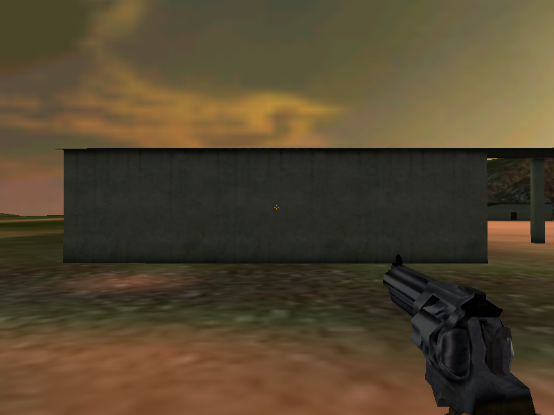
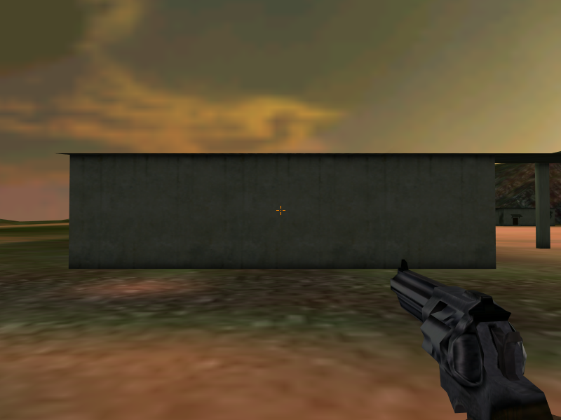
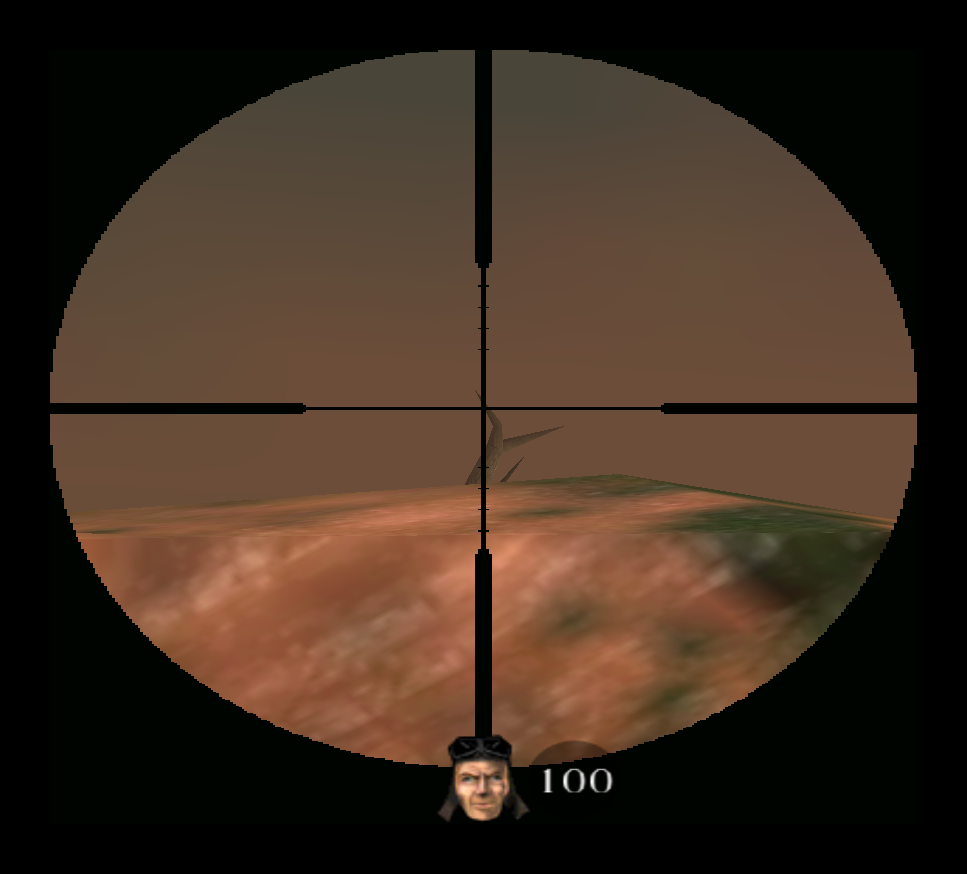
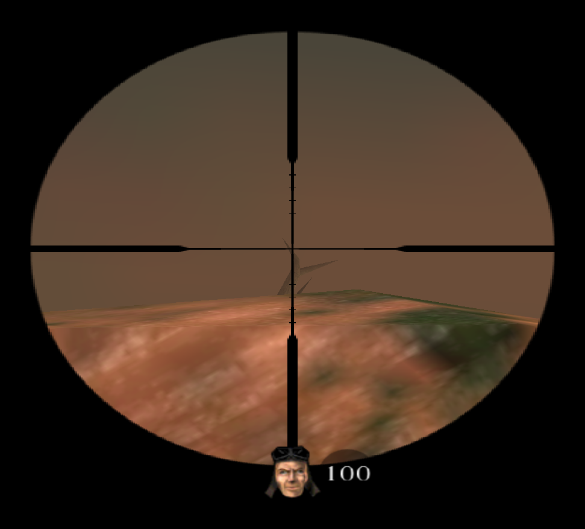

# Codename Eagle community patch

Codename Eagle is a 1999 shooter by Refraction Games. This is a community-made patch, version 1.50, that brings it back to life on modern systems: it fixes the single-player crashes that broke the game after 1.41, teaches the in-game server browser to find internet games (it only ever found LAN games before), and sharpens up how the game looks on today's displays.

It is not an official patch and is not endorsed by DICE or Talonsoft. It builds on everything that came before: the official 1.33, 1.36 and 1.41 updates, the unofficial 1.42 SEB fix, and Dafoosa's unofficial 1.43 that was the online standard for years.

Community site: [codenameeagle.net](https://codenameeagle.net).

## Getting it

Grab a build from the [releases page](https://github.com/rexxars/codename-eagle-patch/releases) (or from [codenameeagle.net](https://codenameeagle.net)). There are three ways to play, depending on what you already have:

- **Multiplayer demo installer** is the easiest way to start. It is a normal Windows setup wizard and needs nothing else: install it and play online. Pick this if you just want to jump into multiplayer.
- **Multiplayer demo zip** is the same game as the demo installer, packaged as an extract-and-play zip with no installer. Because it skips the installer, Windows will not have firewall rules for it, so the first time you host a game Windows may ask you to allow `ce.exe` and `lobby.exe` to use the network (the prompt sometimes opens behind the game window).
- **Full-game 1.50 patch** upgrades a full installation you already own. Run it, point it at your Codename Eagle folder, and it brings any version from 1.0 to 1.43 up to 1.50 in one step. Your saved games, high scores and key bindings are kept.

Want to run a server for others? There is a ready-made [dedicated server Docker image](docker-dedicated/).

## What it changes

<!-- GENERATED:changes:start -->

### Multiplayer and internet play

- **The in-game server browser finds internet games.** Click Refresh list and the browser finds live internet servers and LAN games, with real server names, map names and player counts, so you can join straight from the menu.
- **Hosted games are announced to the community master server.** Hosting a game announces it to the community master server (ceservers.net), the replacement for the long-dead GameSpy master, so friends can find it.
- **One-click join with cneagle:// links.** The game registers itself as the handler for cneagle:// links, so a server link from the community site, Discord or a browser launches the game and drops you straight into that server.
- **Dead links updated.** The old URLs the game showed on version mismatches and similar now point at the current community site, codenameeagle.net.
- **No more black screen from a stuck session.** Starting a game clears out any leftover ce.exe and lobby.exe processes from a crashed or abandoned session, so hosting or joining no longer leaves you on a black screen.
- **Dedicated servers idle quietly.** An empty dedicated server no longer pegs a CPU core; the game loop is throttled while nobody is connected and switches back to full speed the instant a player joins.
- **Dedicated servers keep a log of who joins and leaves.** A dedicated server now records its events (server loaded, players joining, leaving and losing connection) to logs\server.log, so you have a record even when the server console is not visible.

### Gameplay and balance

- **The "8 trick" no longer works.** Fire delays are tracked per weapon, so re-selecting the weapon in your hands no longer cancels its cooldown to fire twice as fast, while switching to a different weapon still fires as soon as it is raised.
- **The spontaneous explosion bug (SEB) is fixed.** Firing at the ground can no longer randomly kill the shooter; a stray out-of-world projectile is silently removed instead of detonating its owner, on every map.
- **Single-player turret balance restored (full game).** The single-player base turrets are back to their v1.36 strength, undoing a v1.41 multiplayer balance change that leaked into the campaign and made it brutally hard. Multiplayer balance is untouched.

### Stability and housekeeping

- **A tidy game folder.** Logs go in logs\, screenshots in screenshots\ and savegames in saves\ (existing saves are moved there for you), the stray player<N>.txt dumps are gone, and the game starts correctly regardless of working directory.
- **A sharper icon.** The game icon is now embedded directly in ce.exe, so Windows shows it in Explorer, the taskbar and shortcuts. It uses a high-resolution image that stays crisp on modern displays and still renders correctly on older systems such as Windows XP. A second, classic icon is embedded as an alternate you can pick from a shortcut.
- **Single-player crash near enemy bases fixed (full game).** The long-standing "floating point error" crash that could hit when you approach an enemy base is fixed (a bug in the mounted-turret code introduced in v1.41).
- **Save-game crash on modern graphics cards fixed (full game).** Saving the game no longer crashes on modern graphics cards. With the bundled dgVoodoo the save-slot thumbnail is captured as normal; the change is a safe guard that only steps in to prevent the crash if the capture ever fails.

### Graphics and display

- **The aiming crosshair scales with resolution.** The screen-center crosshair now scales with screen height, so it stays visible and the same apparent size at 1080p, 1200p and beyond instead of being a tiny fixed 8-pixel sprite.
- **The sniper scope is smoother.** The sniper scope overlay is a 32-bit texture with real antialiased alpha, giving a smooth lens edge and clean reticle lines instead of hard staircase pixels when upscaled.
- **dgVoodoo graphics wrapper included.** The dgVoodoo graphics wrapper is bundled to fix rendering issues on modern versions of Windows and to make options like anti-aliasing easy to enable. Run dgVoodooCpl.exe to configure it.
- **Multiplayer-demo menu options show their selected state.** On the old multiplayer demo, several menu options never showed a checkmark when selected, so you could not tell they were active. The demo was missing the graphics those states use; the patch adds them back from the full game, so the affected options display correctly again. The full game was never affected.

### Single player (full game)

- **The gas mask in "Demolition Man" shows in your inventory.** In the "Demolition Man" mission the gas mask the village elder hands you now appears as an inventory item with its own icon, instead of being equipped invisibly. It is purely cosmetic.
- **No more videos at every launch, and the campaign intro plays where it belongs.** With the CD cutscenes copied into the game folder, the game no longer replays three videos at every launch; the game story and campaign intro play at the mission 1 opening the first time you start the campaign in a session.

### Music (full game)

- **No CD needed, and no CD crashes.** The soundtrack can play from Ogg Vorbis files in a music\ folder instead of the CD, with its own volume on the in-game music slider, and the crash on launch with a CD in the drive is gone.

<!-- GENERATED:changes:end -->

The [full changelog](game/common/readme150.txt) lists every change.

## See the difference

<!-- GENERATED:screenshots:start -->

**The aiming crosshair scales with resolution**

| Before                                                       | After                                                          |
| ------------------------------------------------------------ | -------------------------------------------------------------- |
|  |  |

**The sniper scope is smoother**

| Before                                               | After                                                  |
| ---------------------------------------------------- | ------------------------------------------------------ |
|  |  |

<!-- GENERATED:screenshots:end -->

## Playing online

Version 1.50 changes the network protocol, so you play online with other 1.50 players. Hosted games show up in the in-game server browser and on [codenameeagle.net](https://codenameeagle.net), and you can join most of them with a single click.

## Music and cutscenes (full game)

The soundtrack and the cutscenes shipped on the original Codename Eagle CD and were never part of any patch, so they are not included here. You can add them from your own disc at any time:

- **Music:** rip the CD audio to Ogg Vorbis files with the bundled `ripmusic` tool and drop them in a `music` folder. The game then plays the soundtrack without the CD.
- **Cutscenes:** copy the CD's `cutscn` folder into your game folder to watch the cutscenes without the CD. Do this before playing the campaign: the campaign opening plays as mission 1 starts, and like any Codename Eagle cutscene the game asks for the CD if the file is missing.

## Building from source

This repository holds the tooling that produces the releases above. If you only want to play, use a release; you do not need to build anything. If you want to build the installers, work on the patch, or contribute, see [CONTRIBUTING.md](CONTRIBUTING.md).

## License

MIT. See [LICENSE](LICENSE).
